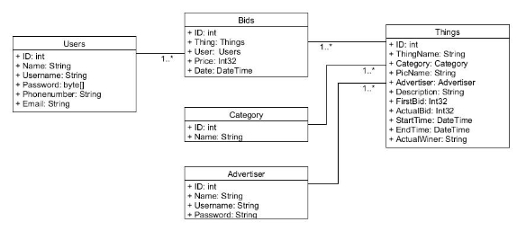
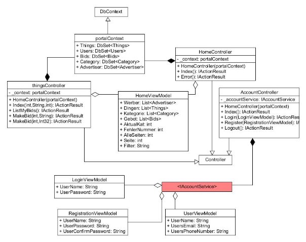

Horváth Milán  Webes alkalmazások fejlesztése  1. Beadandó B1V655 

**Feladat:**  

Készítsünk egy aukciókkal foglakozó online rendszert, ahol különböző tárgyakra licitálhatnak a felhasználók.  

1\. részfeladat: a webes felületet a licitálók használhatják a tárgyak megtekintésére, illetve ajánlattételre.  

- A  főoldalon  a  legutoljára  meghirdetett  20  tárgy  listázódik  (név,  hirdető,  jelenlegi licitösszeg), de lehetőségünk van kategóriánként megtekinteni az összes (még aktív) hirdetést.  Egy  oldalon  legfeljebb  20  tárgy  látható  (a  meghirdetés  dátuma  szerint csökkenő sorrendben), az oldalak között lapozni lehet. A lista szűrhető név(részlet)re. A tárgyat kiválasztva megjelennek a részletes adatok (kép, leírás, lezárás és meghirdetés dátuma, aktuális licit).  
- A  licitálónak  előbb  regisztrálnia  kell  az  oldalon  (név,  telefonszám,  e-mail  cím, felhasználónév,  jelszó,  megerősített  jelszó),  majd  ezt  követően  bejelentkezhet.  A bejelentkezett felhasználó kijelentkezhet.  
- Bejelentkezést követően érhető el a licitálás minden aktív tárgynál. Licitáláshoz ki kell jelölni a tárgyat és meg kell adni az összeget. Első licit esetén az összegnek a minimális licitnek kell lennie, később pedig mindenképpen nagyobbnak kell lennie a korábbi liciteknél.  Egy  felhasználó  tetszőlegesen  sokszor  licitálhat  egy  tárgyra.  A  licitet visszavonni nem lehet. 
- A felhasználó külön listázhatja azokat a tárgyakat, amelyekre legalább egyszer licitált. A listában külön megjelöljük az aktív tárgyakat, valamint azokat, ahol vezeti a licitet. 

**Elemzés:** 

- A  feladatot  ASP.NET  Core-ban,  MVC  architektúrával  és  Entity  Framework segítségével valósítjuk meg. 
- A Weblap tetején a főoldal gomb elérhető bárki számára, mellyel frissíteni lehet, illetve adott listából való visszalépést kezeli. Belépés után egy második gomb is megjelenik, ahol a saját leadott liciteim nézhetem meg. 
- Megnyitáskor a kategóriák láthatók felsorolva, alattuk pedig a 20 létrehozott legutóbbi tárgy. 
- A kategóriára való kattintással megjelennek az adott kategóriák alatt lévő tárgyak. A listázás során oldalanként 20 tárgyat listázunk, ahol azokat létrehozási dátum alapján fordítottan rendezzük. Ilyenkor megjelenik alul az „előző oldal”, illetve „következő oldal” gombok. 
- Amint  beléptünk  és  licitálni  szeretnénk,  rákattintunk  a  licitálás  gombra.  Ilyenkor megjelenik az adott tárgy a legutóbbi licit a minimális licitár. Ha valamit elhibázunk akkor megjelenik az utasítás, hogy rossz adatot adott meg, vagy esetleg az már lejárt. Ha sikerült a liciteim oldalra dob, ahol láthatjuk a megtett liciteket. 
- A  liciteim  oldalon  láthatjuk a  liciteket 3 színnel  jelölve, aktív  és  vezetem  - zöld, megnyertem, tehát nem aktív, de vezetem - világos zöld, illetve aktív az kék, a többi fekete. 

1. *ábra: A felhasználói esetdiagram* 

**Tervezés:** 

Programszerkezet: 

- A  programot  MVC  architektúrában  valósírjuk  meg.  A  modellek  a  Models,  a kontrollerek a Controllers, míg a megjelenítésért felelős alprogramok, és osztályok a Views névtérben helyezkednek el. 

Modell: 

- A  modellnek  feladata  leírni,  hogy  milyen  táblákkal  dolgozik  az  adatbázis  ezt tartalmazza a portalContext. 
- Tartalmazza a táblák sémáinak, illetve a táblák létrehotásához szükséges adatait, ezeket a táblákról elnevezett osztályokban találjuk: Users, Bids, Things, Advertiser, Category. 
- Az Interfacet és a hozzá tartozó leszármaztatott osztályt is itt tároljuk mely hozzáférést ad a nézetmodellekhez, melyek kezelik a felhasználókat. 
- A nézetmodellekhez tartozó osztályok: 
- UserViewModel: Összeköti a felhasználói adatbázist az AccountService-el. 
- LoginViewModel: Egy felhasználóhoz tartozó hiba visszaadásáért, ahol nézzük, hogy helyes-e a jelszó. 
- RegistrationViewModel:  Egy  felhasználóhoz  tartozó  email,  név,  jelszó, felhasználónévhez  tartozó  hibák  visszaadásáért,  ahol  reguláris  kifejezéssel ellenőrizzük a bevitt adatok helyességét. 
- HomeViewModel: Tartalmazza a szükséges táblák listáját, illetve hogy milyen kategóriában milyen filterrel keresünk aktuálisan, az oldalak számát és az adott oldalszámot. 
- A Data osztály felelős az adatbázis előre feltöltéséért. 

2. *ábra: Az adatbázis kapcsolatok, és táblák* 

Kontrollerek: 

A kontrollerek közé három különböző kontroller került, attól függően, hogy mit vezérelnek. 

- thingsController: Index( ) alprogramja felelős az adott kategóriában lévő tárgyak adott szűrésre  vonatkozó  felsorolásáért,  annak  oldalra  történő  lebontásáért.  MakeBid(int, String ) alprogram az adott tárgy részletes listázásáért felelős, illetve a MakeBid(int, Int32 ) a tárgy elhelyezéséért az adatbázisban. A ListMyBids( ) megfelelően jelölve listázza a saját liciteket. 
- HomeController: Index( ) alprogramja felelős a kategóriák és a tárgyak kigyűjtéséért rendezett sorrendben, majd átadja a nézetnek a szükséges adatokat. 
- AccountController:  Login(LoginViewController)  felelős  az  adott  személy bejelentkezésének kezeléséért. A Logout() kilépteti a felhasználót és lezárja a sessiont. A Register(RegistrationViewModel) felelős a regisztrációk kezeléséért. 

Nézet: 

- A nézetet a HomeViewModel kezeli a HomeController és thingsController osztályok esetén,  Az  AccountController  esetén  pedig  az  IAccountServise  interface  által összefogott  nézetmodellek  szolgáltatják,  melyek  a  következők:  UserViewModel, LoginViewModel, RegistrationViewModel. 

3. *ábra: Az alkalmazás osztálydiagramja* 
4 
